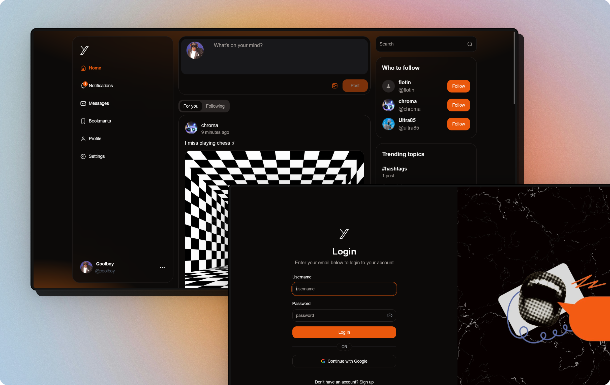

# [Y - Social Media App](http://localhost:3000)

A modern social media platform similar to X (formerly Twitter)

## ✨ Features

- Timeline Experience: Browse For You and Following feeds with real-time post updates
- Interactive Posts: Create, like, and comment on posts with rich text editing
- User Profiles: Customize your profile with avatars and bio information
- Follow System: Connect with other users by following their accounts
- Dark/Light Mode: Switch between themes for comfortable viewing in any environment
- Trending: Stay updated with trending topics and popular discussions
- Infinite Scrolling: Smoothly load additional content as you scroll
- Responsive Design: Optimized experience across desktop and mobile devices

## 🧰 Tech used

- Next.js 15
- React 19
- TypeScript
- Prisma
- Lucia Auth
- Tailwind CSS
- Shadcn UI
- TanStack Query
- Tiptap Editor
- UploadThing

## 💻 Setup Locally

1. Clone the repository
2. Install dependencies: `pnpm install`
3. Set up your database and configure the environment variables in `.env` according to `.env.example`
4. Run the development server: `npm run dev`
5. Open `http://localhost:3000` in your browser

## 🛣 Roadmap

- [ ] Fix loading texts
- [ ] Fix not found page width
- [ ] Implement direct messaging

## 💡 Learnings

- Using `suppressHydrationWarning` for themes
- Optimizing cache with `unstable_cache` and upcoming `use cache()` in Next 15
- Managing API responses with proper date handling using `ky`
- Implementing proper cache clearing upon user logout
- Creating infinite scroll using pagination with `useInfiniteQuery`
- Efficient cache mutation strategies for updating timelines
- Handling avatar uploads with proper image resizing and domain whitelisting

## 📜 License

[MIT](https://choosealicense.com/licenses/mit/)

## 💙 Acknowledgements

- [Shadcn UI](https://ui.shadcn.com/) for accessible UI components
- [TanStack Query](https://tanstack.com/query/latest) for efficient data fetching
- [Prisma](https://www.prisma.io/) for database ORM
- [Lucia Auth](https://lucia-auth.com/) for authentication
- [UploadThing](https://uploadthing.com/) for file uploads
- [Coding in Flow](https://www.youtube.com/@codinginflow/videos) for the best tutorial

<strong>⭐ Leave a star maybe? ⭐</strong> 

<a href="https://github.com/buneeIsSlo/y">Source</a>
| <a href="https://x.com/awwbhi2" target="_blank">Twitter</a>
| <a href="https://github.com/buneeIsSlo" target="_blank">GitHub</a>

